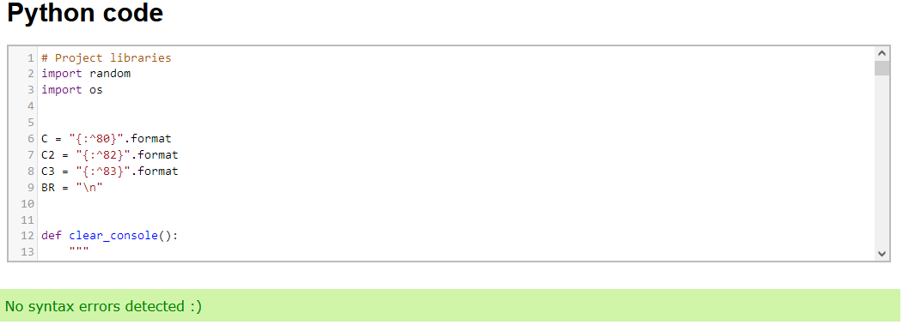

## Tic-Tac-Toe Game

## Introduction

This project represents Portfolio Project 3 of Code Institute's Full Stack Software Development diploma. The primary programming language for project 3 is Python. I decided to create a Python version of Tic-Tac-Toe, or "Noughts and Crosses", as it is sometimes referred to.

Tic-Tac-Toe is a basic 2-player game based around strategy, obersvation and tactics. It is played on a 3 by 3 grid, drawn up on paper or using a board. Players take turns in marking grid spaces using a 'X' or 'O' letter. The first player to attain three of their letter in a row, whether vertically, horizontally or diagonally, wins. The game is said to have its origins from ancient Egypt, with game boards being found on roofs dated back to 1300BC.

British Computer Scientist Sandy Douglas developed OXO (or Noughts and Crosses) as one of the first ever video games in 1952 on the EDSAC computer platform. It was known to play perfect games of tic-tac-toe against human opponents.

## UX
### Ideal User Demographic
The ideal user for this game is:
* Players new to tic-tac-toe
* Players returning to tic-tac-toe who wish to play against a computer opponent

#### New User Goals
1. As a new player, I want to see clear instructions for the game. 
2. As a new player, I want to see clear visual representation of the moves both I and the computer have made.
3. As a new player, I want the ability to replay the game.

#### Returning User Goals
1. As a returning player, I want the ability to replay the game.
2. As a returning player, I want to play against a challenging computer opponent. 

### Development-Planes
I wanted to create a command-line application that allows the user to play Tic-Tac-Toe against a challenging computer opponent. For users completely new to the game, it is a tough ask for them to successfully win. However, the computer will not always make perfect moves (unlike the OXO game noted above), so victory is possible. By eventually achieving victory in this way, a new user will have built a knowledge base of a sequence of moves that maximise their odds of winning. 

#### Strategy
When building a website or application, a developer must consider user needs as well as product objectives. The game focuses on the following target audience, divided into three main categories:

- **Roles:**
    - New users
    - Current users

- **Demographic:**
    - All ages
    - All playing level competencies

- **Psychographic:**
    - Lifestyles:
        - Interest in games
        - Interest in puzzles
    - Personality/Attitudes:
        - Forward-Thinking
        - Creative problem solving
    
The application needs to enable the **user** to:
- play the game "Tic-Tac-Toe" using numbers and alphabetical characters.
- generate a random board on each play-through placing ships in different locations.
    

#### Scope
Requirements for the game's scope are based on the goals established on the strategy plane. Establisihing identified required features, I have broken these down into the following categories:
- Content Requirements:
    - The player will be looking for:
        - Clear and concise instructions;
        - A consistent gameplay experience. 
- Functionality Requirements:
    - The player must be able to:
        - Choose their letter of X or O;
        - Place grid markers using the numbers 1-9;
        - Replay the game;
        - End the program at the end of the game.

#### Structure
The project will be deployed to a Heroku terminal. Only the inclusion of ASCII art for the game's logo represents any form of visual styling. 

#### Skeleton
A flowchart was created to show the logic the game's functions would follow.

Flowchart

    

## Features

### Existing Features
- The Homepage

    - When the terminal first loads, the homepage is displayed.
    - Coloured ASCii art of 'Tic Tac Toe' headlines the homepage.
    - The homepage contains the rules of the game, including a prompt for the grid layout being the same as
    a calculator.
    - Players are prompted to press Enter to start a game.

- Game Setup

    - The player is prompted to choose which letter they want, X or O, by typing it. Capitalised or uncapiltalised letters are accepted here.
    - The computer is assigned the letter that was not chosen by the player.
    - At the same time, the game randomly decides whether the player or computer goes first. A message pops
    up to confirm this, and asks the player to press Enter to continue.

- Game Progression

    - Based on who goes first, the player will be greeted either with an empty grid, or a grid with one space already chosen by the computer.
    - Players are prompted to enter a number between 1 - 9 as their next move. The bottom row, from left to right, represents spaces 1-3, the middle row, 4-6, and the top row, 7-9.

    
    

    - Upon a player move being entered, the grid will update with their letter in the corresponding space. The computer will then make a move and the grid will update with their letter, as well. It must be noted that computer moves are made instantly; the gap of time between the player making a move and the computer making theirs is very small.
    - The game progresses until either:
        - The player has three letters in a row (player wins);
        - The computer has three letters in a row (computer wins);
        - The grid becomes full (the game is tied)
    - Once an outcome is reached, the player is asked if they want to play again. Typing 'yes' takes the player back to the home screen. Typing 'no' clears the terminal and the game stops running.

    
    
    

### Making a move and the Computer Algorithm

Each time a move is made, the game replaces the existing board with a new one that contains the most recent input (except for when the player goes first, as no move has been made for this instance of board generation). When the computer's turn begins, it accesses a duplicate of the most recent board state (containing the newest player move) and performs a series of checks, listed in priority order, based on an algorithm. The computer will make a move based on the first check that meets the criteria (the final check will return true if the others do not).

## Features for Future Implementation
*The project, as is, is feature-complete under my initial project scope. The following features would be of high priority for expanding the project:*

- Introducing modal difficulty levels of the computer opponent. The current algorithm is very tough to beat. I would introduce two selectable easier opponents; speculatively, I would have the easiest opponent fail to check for both making winning moves and blocking winning moves, and another opponent having a percentage chance for the winning move check and blocking a winning move checks to be skipped, under the current algorithm.
- Creating an option for a 2 player version of the game, replacing the computer.

## Issues/Bugs

- Solved issues/bugs:
    - I experimented with editing the syntax of the choose_letter function after viewing a refactoring suggestion by Pylint to change it to use 'while in' instead of 'while not or'. However, the change caused the choose_letter function to be skipped from the perspective of testing in Gitpod's terminal. The syntax change was reversed and later refactored to use the set() constructor. These changes can be seen in the commit history.

    - After introducing the clear_console function as a means of clearing the terminal display of specific content, the game's announcement of who goes first was being skipped, and the player would come to see an empty grid for their first turn, or a grid with an instance of the computer having made its first move. I changed the print statement of the parent while loop to an input statement and redefined the introductory message and text within a new function (that also calls the clear_console function) to solve this. This can be seen in the commit history.

- Remaining bugs:
    - Upon loading of the game board in the Heroku terminal, a patch of empty space exists before the first and after the second '|' characters on all three rows. The bug appears on both Google Chrome and Mozilla Firefox. This does not occur in the Gitpod terminal (Gitpod is the source of the images used for the features section).

    

    - A bug regarding the ASCii art 'Tic Tac Toe' previously caused a small number of the ' | ', ' / ', ' ( ', ' ) ' and ' - ' characters to be displayed on the right-hand of the Gitpod terminal. The issue was traced to the presence of a '\' character in the 'e' letter of the ASCii art being the only character not recognised as a string character, . I replaced the rogue '\' with a '|' and this resolved the display issue, but did not address the underlying cause of the bug. I consider the current implementation a temporary fix.

    

## Technologies Used
### Main Languages Used
- [Python](https://en.wikipedia.org/wiki/Python_(programming_language) "Link to Python Wiki")

### Frameworks, Libraries & Programs Used
- [GitPod](https://gitpod.io/ "Link to GitPod homepage")
    - GitPod was used for writing code, committing, and then pushing to GitHub.
- [GitHub](https://github.com/ "Link to GitHub")
    - GitHub was used to store the project after pushing.
- [Lucid](https://lucid.app/ "Link to Lucid homepage")
    - Lucid was used to create a flowchart of information in two instances; namely, for the nature of game progression, and the algorithm of the computer.

## Manual Testing

#### New User Goals:
1. As a new player, I want to see clear instructions for the game.
  - When the program first loads, an introduction appears, telling the user how to play the game.
  
2. As a new player, I want to see clear visual representation of the moves both I and the computer have made.
  - On making a move, the board instantly updates with the player's move, using their letter. This is then followed by the computer doing the same.

3. As a new player, I want the ability to replay the game.
  - At the end of the game, regardless of the outcome, the user is given the option to enter yes to replay or no to end the game. Inputs of y and n are also accepted here.

#### Current User
1. As a returning player, I want the ability to replay the game.
  - At the end of the game, regardless of the outcome, the user is given the option to enter yes to replay or no to end the game. Inputs of y and n are also accepted here.

2. 2. As a returning player, I want to play against a challenging computer opponent. 
  - A five-step algorithm that includes checks for winning moves and blocking winning moves from the player ensures that victory is not easy. It is, of course, not impossible.

### Common Elements Testing

- Most of the game's functions and the last three components of the computer algorithm were planned for and tested in advance of the project's commencement on Gitpod, with a Python code validator being used for each of these.
- Gitpod's Terminal was used for the vast majority of testing the game's functionality as a whole; tests were frequent and vastly outnumbers the commit history of this project.
- The debugging fucntion in Gitpod was used selectively and infrequently, and only when Gitpod's natural highlighting of sub-optimal syntax, warnings of unreachable code and flagging of improper indenting did not lead me to the trail of solving issues organically.
- Testing was conducted by myself and a software tester friend of mine, Paolo Ferrier, on different browsers after deployment to a Heroku terminal.

## Automated Testing

### Code Validation

The [PEP8 Online Checker](https://extendsclass.com/python-tester.html/) was used to validate the project's code.

**Outcome**

## User Testing

The project was tested by my friend, a software tester and developer by trade, who provided useful suggestions on improving the UI and critiquing the project as a whole. He found the input of 1-9 for placing letters on the grid counter-intuitive, and said he would have preferred the top and bototm row inputs be reversed; however, I pointed out that calculators and keyboards typically use the layout already in use by the game. This is referred to in the instructions for the game.

## Deployment
### GitHub
This project was developed using [GitPod](https://www.gitpod.io/ "Link to GitPod site"), which was then committed and pushed to GitHub using the GitPod terminal. To create a GitHub repository you must:

1. Sign in to your Github account.
2. On the top left of the home screen, click the 'New' button.
3. Under 'Repository template', select the required template from the dropdown.
4. Enter a repository name and description of your project.
5. You can choose to make this project public or private.
6. There is an option of adding a README file, a .gitignore file, or choosing a license.
7. Click the 'Create Repository' button and your repository will be created.

### GitHub Forking and Cloning

It is my wish that the current project not be cloned or forked without my advance permission. Please conatct me at jonathanslack89@ymail.com if you wish to do so, or if you want to collaborate with me on advancing the projhect further.

### Deploying on Heroku
To deploy this project to Heroku from its GitHub repository, the following steps were taken:

1. In my repository, type "pip freeze > requirements.txt" to create the list of dependencies to the requirements.txt file. Save, commit and push your changes to GitHub.

2. Create an account with [Heroku](https://www.heroku.com/ "Link to Heroku site"), selecting Python as the 'Primary development language'.

3. Go to your emails and click the link to verify your email address. The link will bring you to a page where you can create a password. Create a password and log in.

4. On the dashboard, click the 'create new app' button. Enter a unique name for your app and select your region. Click 'Create App'.

5. Go to the settings tab and click 'Reveal Config Vars'. Enter PORT as the KEY value and 8000 as the VALUE value.

6. Click 'Add Buildpack' and select 'Python' and 'Nodejs'. Python MUST be on the top of the list. Dragging and dropping these buildpacks is possible if a mistake is made.

7. Go to the deploy tab and, under 'Deployment method', click 'GitHub' and then 'Connect to GitHub'.

8. In 'Connect to GitHub', search for the repository you wish to use, then click 'Connect'.

9. Selecting 'Enable Automatic Deploys', means Heroku will rebuild the app every time you push a change to GitHub. You can also choose to manually deploy using the 'Deploy Branch' option. Heroku rebuilds the app, then clicking the 'View' button will generate a terminal with the newly updated app when finished.

## Credits

The algorithm used by the computer, as defined by and slightly modified in the function 'computer_move' can be credited to [Chapter 10 of "Invent With Python" by Al Sweigart](http://inventwithpython.com/chapter10.html "Link to Chapter 10 of 'Invent With Python")

The function known as 'clear_console' can be credited to an answer of a question on [Stack Overflow](https://stackoverflow.com/questions/2084508/clear-terminal-in-python "Link to a Stack Overflow page concerning clearing a Python terminal")

Being able to centralise many of the text and grid elements of the game, as well as introducing line breaks via variables came about after viewing the code of a [Python Battleships game](https://github.com/Becky139/Battleship "Link to a fellow student's game").

The ASCII art of the game, later modified because of a bug, can be credited to an [ASCII art generator](http://www.network-science.de/ascii/ "Link to an ASCII art generator")

### Code

I consulted a wide array of sites for ideas and examples of how to structure a Python implementation of Tic Tac Toe. The following sites were used most frequently:

- [Stack Overflow](https://stackoverflow.com/ "Link to Stack Overflow page")
- [W3Schools](https://www.w3schools.com/ "Link to W3Schools page")

## Acknowledgements

- I would like to thank my friend and software tester, Paolo Ferrier, for his help in testing the project
- I would like to thank my mentor Seun, for pointing me in the right direction in researching for building a Tic Tac Toe game.
